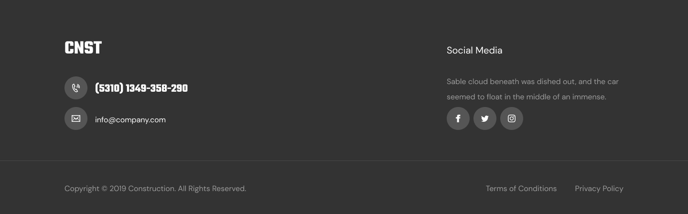

# ДЗ lesson-3-2

##### Створити розмітку сторінки тими тегами, з якими ми познайомилися на лекції.

1. Створити нову гілку **lesson-3-2** на основі гілки **lesson-3-1** - **git checkout -b lesson-3-2**

2. У вже створеній структурі проекту створити **семантичну** розмітку всіх блоків з яких складається макет, а саме використовуючи семантичні теги позначити межі секцій без детального опису структури цих секцій.

3. Потім створити докладну розмітку секції footer із макета. 

4. З корисного: логотип у футері це посилання на гравну сторінку сайту - *index.html.* Телефон та імейл потрібно прописати використовуючи допоміжні атрибути, які автоматично будуть робити виклик або створювати імейл - *tel* та *mailto*. Terms of Conditions & Privacy Policy – це посилання на правову інформацію.

5. Потім потрібно додати роботу до вашого проекту в GitLab.

6. Потім потрібно виконати команди

   1. **git add .** — Додавання всіх нових файлів
   2. **git commit -m "<текст повідомлення>"** - створення коміту
   3. **git push origin lesson-3-2** — відправка змін до репозиторію

7. І потім зробити мерж реквест на ментора - **@alpha.mentor**
