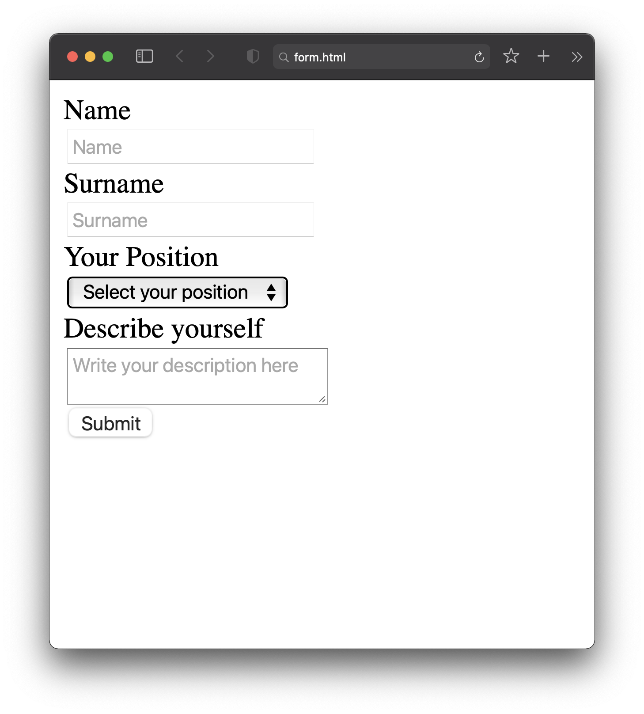

**Завдання 1**

Створіть верстку як на скріні.

**Важливо!** Кожне поле введення має бути пов'язане зі своїм `label`.
*Примітка!* Для того щоб всі елементи стали в стовпчик потрібно додати наступне в тег `head`:

    
