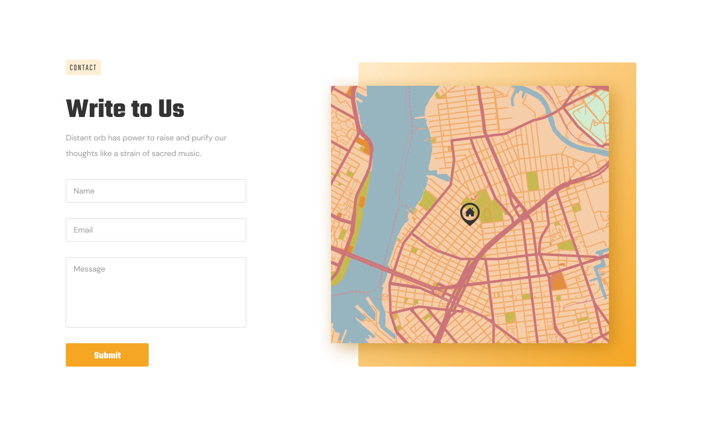

# ДЗ lesson-4-2

1. Создать разметку страницы теми тегами, с которыми мы познакомились на лекции.

2. На основе ветки **lesson-4-1** создать ветку **lesson-4-2**

3. Продолжить работать с файлом **prj/index.html** 

4. Открыть наш дизайн, и при помощи тегов, с которыми мы познакомились на лекции, создать разметку, согласно секции

5. Добавить новык изменения в индексацию **Git**, для этого нужно выполнить команды **git add .** и **git commit -m "сообщение"**

   ​	

6. ### ВСТРАИВАТЬ КАРТУ НЕ НУЖНО! СОЗДАТЬ РАЗМЕТКУ ТОЛЬКО ЛЕВОЙ СЕКЦИИ!!!

