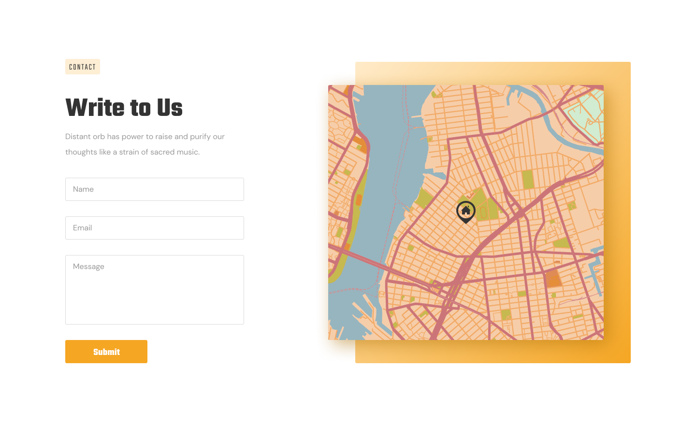

# ДЗ lesson-4-2

1. Створити розмітку сторінки тими тегами, з якими познайомилися на лекції.

2. На основі гілки **lesson-4-1** створити гілку **lesson-4-2**

3. Продовжити працювати з файлом **prj-1/index.html**

4. Відкрити наш дизайн і за допомогою тегів, з якими ми познайомилися на лекції, створити розмітку, згідно з секцією

5. Додати нові зміни до індексації **Git**, для цього потрібно виконати команди **git add .** та **git commit -m "повідомлення"**

   ​	

6. ### ВСТРОЮВАТИ КАРТУ НЕ ПОТРІБНО! СТВОРИТИ РОЗМІТКУ ТІЛЬКИ ЛІВОЇ СЕКЦІЇ!
