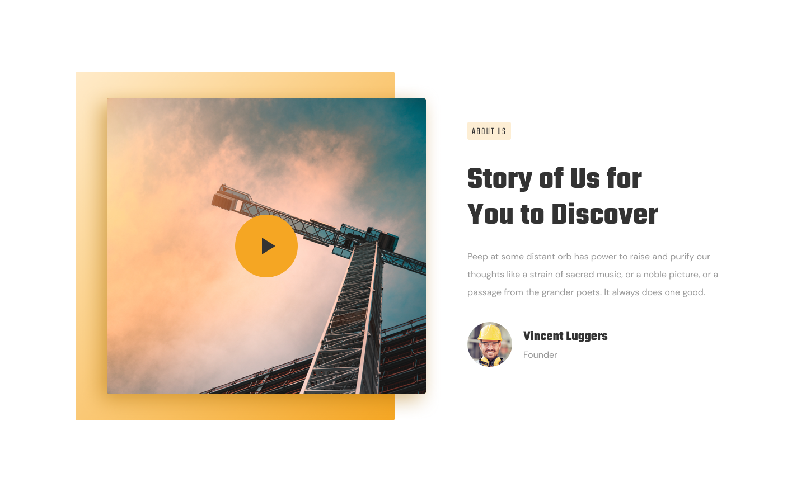

# ДЗ lesson-5-1

1. Создать разметку страницы  теми тегами, с которыми мы познакомились на лекции.

2. Для этого, от ветки **main**, вам нужно будет создать новую ветку **lesson-5-1**

3. Нужно переключится на ветку  **main**

   1. **git checkout main** – Переключение нa ветку lessons
   2. **git pull** - Забираем изменения которые ментор проверил
   2. **git checkout main -b lesson-5-1** - создаем новую ветку

5. Добавить новую папку в индексацию **Git**, для этого нужно выполнить команды **git add .** и **git commit -m "сообщение"**

6. Продолжить работать с файлами проекта **prj-1/index.html** 

7. Открыть наш дизайн, и при помощи тегов, с которыми мы познакомились на лекции, создать разметку, согласно секции

   ​	

10. С помощью **iframe** добавить любимый клип из YouTube на место видео. Видео как добавить **ifreme** видео с YouTube лежит в той же директории что и задание!

