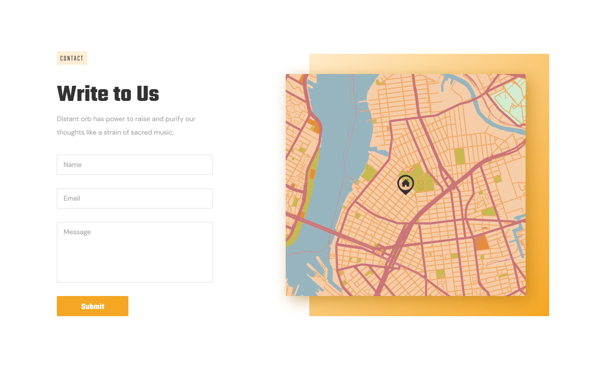

# ДЗ lesson-5-2

1. Створити розмітку сторінки тими тегами, з якими познайомилися на лекції.

2. На основі гілки **lesson-5-1** створити гілку **lesson-5-2**

3. Продовжити працювати з файлом **prj-1/index.html**

4. Відкрити наш дизайн і за допомогою тегів, з якими ми познайомилися на лекції, створити розмітку, згідно з секцією

5. Додати нові зміни до індексації **Git**, для цього потрібно виконати команди **git add .** та **git commit -m "повідомлення"**

   ​	

6. Вбудувати карту за допомогою Google Maps (точку поставити Київ, Україна або будь-яку іншу). Відео про те, як дістати код карти, лежить у тій же директорії, що й завдання!
